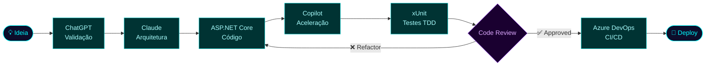

<div align="center">

[](https://git.io/typing-svg)

[](https://www.linkedin.com/in/willianscostapaulino)
[](https://github.com/Willians167)
[](https://www.instagram.com/will_the_dev_)
[](https://discord.com/users/will167)
[](mailto:prwillians.costa@gmail.com)


</div>


## � Terminal Interativo

> *Clique em cada comando para executar*

<details>
<summary><code>$ whoami</code></summary>

```bash
╔══════════════════════════════════════════════════════════╗
║        WILLIANS COSTA — DEVELOPER PROFILE v2.0           ║
╚══════════════════════════════════════════════════════════╝
  Name     : Willians Costa
  Role     : .NET Developer | AI-Assisted Engineer
  Location : Santos, SP — Brasil
  Status   : 🟢 Open to new challenges
  Focus    : Scalable APIs · Clean Architecture · AI Tools
  Quote    : "Transformando ideias complexas em software elegante."
```

</details>

<details>
<summary><code>$ skills --list</code></summary>

```bash
$ skills --list

[Backend]     ██████████  C# · ASP.NET Core · Blazor
[Cloud]       █████████░  Azure · DevOps · Docker
[Database]    ████████░░  SQL Server · MySQL · MongoDB
[Frontend]    ██████░░░░  JavaScript · HTML · CSS
[AI Tools]    █████████░  Copilot · Claude · ChatGPT
[Testing]     ████████░░  xUnit · TDD · Clean Tests
[Practices]   █████████░  Clean Code · DDD · SOLID
```

</details>

<details>
<summary><code>$ projects --featured</code></summary>

```bash
$ projects --featured

 ID  NAME                          STACK                    STATUS
 ──  ────────────────────────────  ───────────────────────  ────────
 01  Vehicle Catalog API           ASP.NET Core+JWT+MySQL   ✅ LIVE
 02  TDD Calculator                C# + xUnit               ✅ LIVE
 03  Google Dino Clone             JS + HTML + CSS          ✅ LIVE
 04  [CLASSIFIED]                  Microservices + Azure    🔒 WIP
```

</details>

<details>
<summary><code>$ run ai-workflow</code></summary>

```bash
$ run ai-workflow

[INFO]  Initializing AI-Assisted Development Pipeline...
[OK]    ChatGPT       → idea validation & architecture draft
[OK]    Claude        → deep reasoning & code review
[OK]    Copilot       → real-time code generation
[OK]    Azure OpenAI  → production AI integration
[DONE]  Pipeline ready. Building solution...
        ████████████████████████ 100% — Deploy successful ✅
```

</details>


## 👨‍💻 Sobre mim

Desenvolvedor **.NET** focado em soluções escaláveis. Cursando **Ciências da Computação** na **Universidade Anhembi Morumbi**, especializado em construir sistemas limpos, testáveis e orientados a arquitetura.

- 🚀 **APIs RESTful** com ASP.NET Core · Minimal APIs
- ☁️ **Azure** · DevOps · Docker · CI/CD
- 🧪 **Clean Code** · TDD · DDD · SOLID
- 🗄️ **SQL Server** · MySQL · MongoDB
- 🖥️ **Blazor** — rumo ao Fullstack .NET
- 🤖 **GitHub Copilot** · Claude · ChatGPT no workflow diário


## 🔧 Skill Tree

<details open>
<summary><b>⚙️ Backend & .NET</b></summary>
<br>
<div align="center">
  
</div>
</details>

<details>
<summary><b>☁️ DevOps & Cloud</b></summary>
<br>
<div align="center">
  
</div>
</details>

<details>
<summary><b>🗄️ Databases</b></summary>
<br>
<div align="center">
  
</div>
</details>

<details>
<summary><b>🌐 Frontend</b></summary>
<br>
<div align="center">
  
</div>
</details>

<details>
<summary><b>🤖 AI Tools</b></summary>
<br>
<div align="center">


</div>
</details>


## 🎮 Developer RPG Stats

```
╔══════════════════════════════════════════════════════════════════╗
║  WILLIANS167                               CLASS: .NET Mage      ║
║                                                                  ║
║  [ LVL ] ████████████████████░░░░░░  78 / 100 XP                ║
║                                                                  ║
║  ⚔️  C# / ASP.NET Core         MAX  ██████████████████████████  ║
║  🛡️  Clean Architecture         LVL9 ████████████████████████░  ║
║  🔮  Azure / Cloud              LVL8 ███████████████████████░░  ║
║  🤖  AI-Assisted Dev            LVL9 ████████████████████████░  ║
║  🧪  TDD / Testing              LVL8 ███████████████████████░░  ║
║  🌐  Blazor / Frontend          LVL7 █████████████████████░░░░  ║
╚══════════════════════════════════════════════════════════════════╝
```

<details>
<summary><b>🏆 Conquistas — Clique para expandir</b></summary>
<br>

| Status | Conquista | Descrição |
|:---:|---|---|
| ✅ | **API Architect** | APIs RESTful com JWT, segurança e boas práticas |
| ✅ | **Test Warrior** | TDD com cobertura de testes em C# e xUnit |
| ✅ | **Cloud Rider** | Deploy na Azure com pipelines CI/CD |
| ✅ | **AI Native** | Copilot, Claude e ChatGPT integrados ao workflow |
| ✅ | **Container Captain** | Aplicações containerizadas com Docker |
| ✅ | **Open Source Dev** | Projetos públicos ativos no GitHub |
| 🔒 | **Microservices Architect** | *Unlock: build a distributed system with 3+ services* |
| 🔒 | **SaaS Builder** | *Unlock: deploy a SaaS product with real users* |
| 🔒 | **AI Product Creator** | *Unlock: ship a product powered by LLMs in production* |

</details>


## 🤖 AI Workflow




## 📊 Estatísticas do GitHub

<div align="center">
  
</div>

<div align="center">
  
</div>


## 🐍 Contribuições

<div align="center">
  <picture>
    <source media="(prefers-color-scheme: dark)" srcset="https://raw.githubusercontent.com/Willians167/Willians167/output/github-contribution-grid-snake-dark.svg">
    <source media="(prefers-color-scheme: light)" srcset="https://raw.githubusercontent.com/Willians167/Willians167/output/github-contribution-grid-snake.svg">
    
  </picture>
</div>

<div align="center">
  
</div>


## � Pipeline Status

> *Estado atual dos projetos e automações ativas*

| | Pipeline | Branch | Status | Frequência |
|:---:|---|:---:|:---:|:---:|
| 🟢 | **Vehicle Catalog API** | `main` | `PASSING` | on push |
| 🟢 | **TDD Calculator** | `main` | `PASSING` | on push |
| 🟢 | **Dino Game** | `main` | `PASSING` | on push |
| 🔵 | **Snake Animation** | `output` | `SCHEDULED` | 00:00 · daily |
| 🔵 | **3D Contrib Graph** | `output` | `SCHEDULED` | 02:00 · daily |


## 📖 Minha Jornada

```
2021 ──┬── 🌱 Primeiros passos — HTML, CSS, JavaScript
        │   "A primeira linha de código muda tudo."
        │
2022 ──┼── ⚡ Mergulho no .NET — C#, ASP.NET Core, SQL Server
        │   Descobri a elegância do back-end e a potência do ecossistema Microsoft.
        │
2023 ──┼── 🏗️  Arquitetura & Qualidade — Clean Code, TDD, DDD
        │   Percebi que escrever código é fácil; escrever bom código é uma arte.
        │
2024 ──┼── ☁️  Cloud & DevOps — Azure, Docker, CI/CD pipelines
        │   Código que não vai pra produção não existe. Aprendi a entregar.
        │
2025 ──┼── 🤖 Era da IA — GitHub Copilot, Claude, ChatGPT no workflow
        │   IA não substitui o dev; amplifica quem sabe usá-la.
        │
2026 ──┴── 🚀 Hoje — Fullstack .NET, AI-Assisted, sempre evoluindo
            "Construindo para escalar. Aprendendo para transformar."
```


## 💼 Projetos em Destaque

<details>
<summary><b>🚗 Vehicle Catalog API — Minimal API com JWT e CRUD completo</b></summary>
<br>

> API RESTful de alta performance para gerenciamento de catálogo de veículos, com controle de acesso baseado em roles e testes unitários abrangentes.

**Propósito:** Demonstrar domínio de Minimal APIs, autenticação segura e boas práticas em .NET.

`ASP.NET Core` · `Minimal API` · `JWT` · `MySQL` · `xUnit` · `Docker`

[](https://github.com/Willians167/Trabalhando-com-minimal-Apis-AspNetCore)

</details>

<details>
<summary><b>🧪 TDD Calculator — Desenvolvimento 100% orientado a testes</b></summary>
<br>

> Projeto de referência em TDD, demonstrando o ciclo Red → Green → Refactor com testes unitários robustos em C#.

**Propósito:** Consolidar e demonstrar domínio de Test-Driven Development no ecossistema .NET.

`C#` · `ASP.NET Core` · `xUnit` · `Visual Studio`

[](https://github.com/Willians167/Blindando-Codigo-com-TDD-e-Testes-Unitarios-Csharp)

</details>

<details>
<summary><b>🦕 Google Dino Clone — Lógica de jogo sem frameworks</b></summary>
<br>

> Recriação do jogo do dinossauro do Chrome com animações CSS e efeito parallax, desenvolvida do zero sem frameworks.

**Propósito:** Demonstrar fundamentos sólidos de JavaScript, lógica de programação e manipulação do DOM.

`JavaScript` · `HTML5` · `CSS3` · `Parallax`

[](https://github.com/Willians167/Jogo-do-Dino)

</details>


## 🚀 Objetivos

- Consolidar expertise em **APIs, arquitetura de software** e **Frontend**
- Me tornar desenvolvedor **Fullstack .NET**
- Construir produtos com **IA integrada em produção**
- Contribuir para projetos **open-source**


## 💬 Dev Quote

<div align="center">
  
</div>


