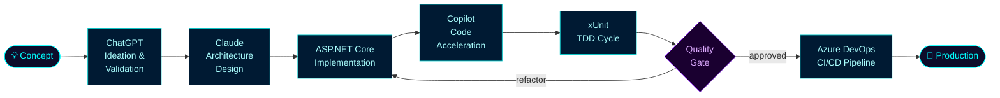

<div align="center">

[](https://git.io/typing-svg)

<br/>

[](https://www.linkedin.com/in/willianscostapaulino)
[](https://github.com/Willians167)
[](https://www.instagram.com/will_the_dev_)
[](https://discord.com/users/will167)
[](mailto:prwillians.costa@gmail.com)


</div>

---

## $ whoami

```bash
┌──────────────────────────────────────────────────────────────────┐
│             WILLIANS COSTA  ·  Software Engineer                 │
├──────────────────────────────────────────────────────────────────┤
│  Role      →  .NET Engineer | Cloud-Native | AI-Assisted Dev     │
│  Location  →  Santos, SP — Brazil                                │
│  Education →  Computer Science · Anhembi Morumbi University      │
│  Status    →  🟢 Open to new challenges                          │
│  Focus     →  Scalable APIs · Clean Architecture · DevOps        │
│  Mindset   →  "Elegant code is engineering, not coincidence."    │
└──────────────────────────────────────────────────────────────────┘
```

I design and build **cloud-native .NET systems** with a strong emphasis on clean architecture, testability, and operational excellence. My workflow integrates AI tools natively — not as a shortcut, but as a force multiplier for engineering quality and velocity.

---

## 🏗️ Engineering Focus

<table>
<tr>
<td width="50%" valign="top">

**Backend & APIs**
- RESTful & Minimal APIs with ASP.NET Core
- Domain-Driven Design · CQRS · Event-driven patterns
- JWT authentication · Role-based access control

**Quality Engineering**
- TDD — Red → Green → Refactor discipline
- xUnit · Clean Tests · Integration testing
- SOLID · Clean Code · Refactoring mindset

</td>
<td width="50%" valign="top">

**Cloud & DevOps**
- Azure (App Services, Functions, Storage, Key Vault)
- Docker · CI/CD with Azure DevOps & GitHub Actions
- Infrastructure as Code · Secrets management

**AI-Assisted Workflow**
- GitHub Copilot · Claude · ChatGPT as pair programmers
- Azure OpenAI for production LLM integrations
- Prompt engineering for architecture & code review

</td>
</tr>
</table>

---

## 🛠️ Technology Stack

<div align="center">

**Core**&nbsp;&nbsp;


**Cloud & DevOps**&nbsp;&nbsp;


**Data**&nbsp;&nbsp;


**Frontend**&nbsp;&nbsp;


</div>

<br/>

<details>
<summary><b>🤖 AI Toolchain</b></summary>
<br>
<div align="center">


</div>
</details>

---

## 🤖 AI-Assisted Engineering Pipeline



---

## 💼 Featured Projects

<details>
<summary><b>🔐 Vehicle Catalog API — Production-grade REST API</b></summary>
<br>

> A high-performance RESTful service for vehicle fleet catalog management, built with Minimal API architecture, JWT role-based authorization, and a comprehensive xUnit test suite.

**Engineering highlights:**
- Minimal API design for low-overhead routing and high throughput
- JWT authentication with role-based access control
- MySQL persistence with Entity Framework Core
- Containerized with Docker; CI pipeline triggered on every push

**Stack:** `ASP.NET Core` · `Minimal API` · `JWT` · `MySQL` · `xUnit` · `Docker`

[](https://github.com/Willians167/Trabalhando-com-minimal-Apis-AspNetCore)

</details>

<details>
<summary><b>🧪 TDD Calculator — Red · Green · Refactor discipline</b></summary>
<br>

> A reference implementation of Test-Driven Development in .NET, demonstrating the full Red → Green → Refactor cycle with high test coverage, behavior-driven naming, and clean abstractions.

**Engineering highlights:**
- Strict TDD discipline with xUnit and fluent assertions
- Demonstrates test isolation, AAA pattern, and edge-case coverage
- Blueprint for engineering teams adopting TDD practices

**Stack:** `C#` · `ASP.NET Core` · `xUnit`

[](https://github.com/Willians167/Blindando-Codigo-com-TDD-e-Testes-Unitarios-Csharp)

</details>

<details>
<summary><b>🦕 Chrome Dino Clone — Vanilla JS game engine</b></summary>
<br>

> A zero-dependency recreation of Chrome's offline dinosaur game, built with pure JavaScript, CSS animations, and a custom parallax scrolling engine.

**Engineering highlights:**
- Custom game loop with `requestAnimationFrame` for smooth 60fps rendering
- Collision detection and procedural difficulty scaling
- CSS parallax layer system for visual depth and immersion

**Stack:** `JavaScript` · `HTML5` · `CSS3`

[](https://github.com/Willians167/Jogo-do-Dino)

</details>

---

## 📈 Engineering Timeline

```
2021 ──┬── 🌱 Foundation — HTML, CSS, JavaScript
        │   The first line of code changes everything.
        │
2022 ──┼── ⚡ .NET Deep Dive — C#, ASP.NET Core, SQL Server
        │   Discovered the elegance of backend systems and the power of the .NET ecosystem.
        │
2023 ──┼── 🏗️  Architecture & Quality — Clean Code, TDD, DDD
        │   Writing code is easy. Writing great code is engineering.
        │
2024 ──┼── ☁️  Cloud & DevOps — Azure, Docker, CI/CD pipelines
        │   Code that doesn't ship doesn't exist. Learned to deliver reliably.
        │
2025 ──┼── 🤖 AI-Native Workflow — Copilot, Claude, ChatGPT as daily tools
        │   AI doesn't replace engineers. It amplifies those who know how to use it.
        │
2026 ──┴── 🚀 Now — Fullstack .NET, AI-integrated systems, always shipping
            "Building to scale. Learning to transform."
```

---

## 📊 GitHub Metrics

<div align="center">
  
</div>

<div align="center">
  
</div>

---

## 🐍 Contribution Graph

<div align="center">
  <picture>
    <source media="(prefers-color-scheme: dark)" srcset="https://raw.githubusercontent.com/Willians167/Willians167/output/github-contribution-grid-snake-dark.svg">
    <source media="(prefers-color-scheme: light)" srcset="https://raw.githubusercontent.com/Willians167/Willians167/output/github-contribution-grid-snake.svg">
    
  </picture>
</div>

<div align="center">
  
</div>

---

## 🚀 Current Focus

- Deepening expertise in **distributed systems, microservices architecture**, and **event-driven design**
- Building toward **Fullstack .NET** with production Blazor applications
- Shipping **AI-integrated products** with Azure OpenAI in production
- Contributing to **open-source** within the .NET ecosystem

---

<div align="center">
  
</div>


